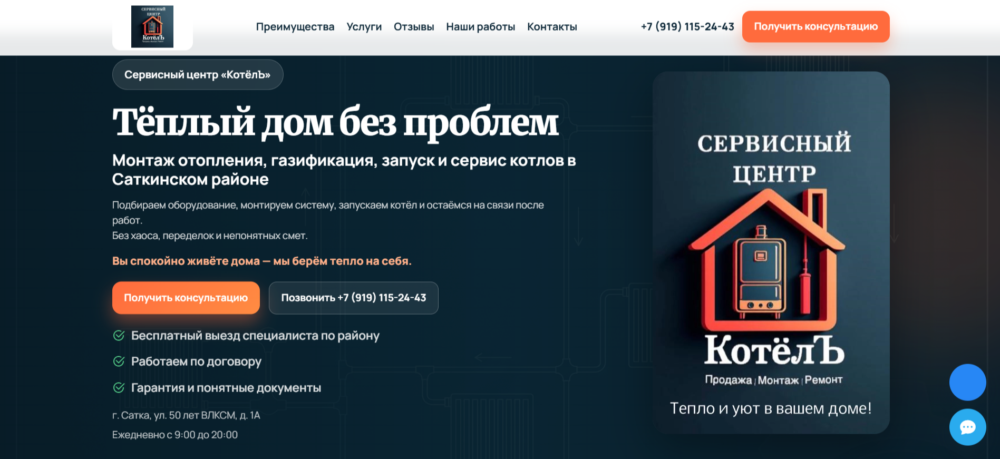
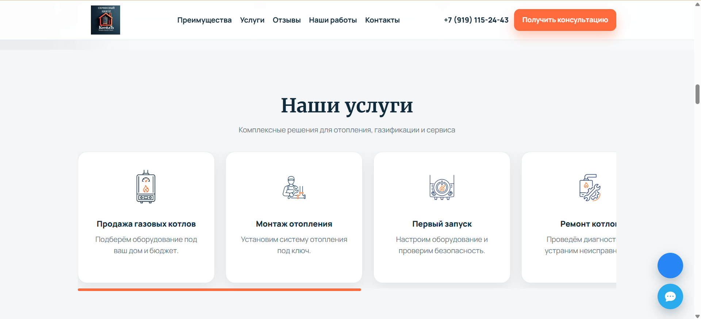

# 🔥 Сервисный центр «КотёлЪ»
### Коммерческий лендинг для услуг отопления и газификации

> Реальный проект для сервисного центра  
> Разработан с фокусом на заявки, доверие и визуальное восприятие

---

## 🟢 Live / Демо

👉 (сюда потом вставить ссылку на сайт)

---

## 🖥️ Обзор проекта

Лендинг разработан для компании, занимающейся:

- монтажом систем отопления
- газификацией частных домов
- запуском и обслуживанием котлов

### Бизнес-задача:

- увеличить количество заявок  
- повысить доверие клиентов  
- выделиться среди конкурентов  
- упростить путь до звонка  

---

## 🎯 Решение

Сайт построен как **конверсионный лендинг**, где:

- пользователь сразу понимает, куда попал  
- видит решение своей проблемы  
- получает доверие  
- быстро совершает действие  

---

## 🧠 UX-логика

Структура страницы:
Hero (оффер + видео + CTA)
↓
Когда стоит обратиться (ситуации клиента)
↓
Почему с нами спокойно (доверие)
↓
Услуги
↓
Срочный блок (проблемы)
↓
Как мы работаем
↓
Отзывы / работы
↓
Форма заявки

---

## 🎨 Дизайн-концепция

- инженерная тематика (схема отопления)
- тёмный фон + акцентный цвет
- визуальный баланс: текст / воздух / акценты
- минимализм без перегрузки

### Ключевая идея:

> «Надёжность, контроль, спокойствие»

---

## 🖼️ Визуал

### Главный экран

---

### Блоки и структура

---

### Мобильная версия

---

## 🚀 Функциональность

- Видео в hero-блоке (без обрезки)
- Плавная анимация появления элементов
- Счётчики достижений
- Интерактивная галерея (lightbox)
- Пошаговый процесс работы с анимацией
- Sticky-кнопки (VK / MAX)
- Форма заявки

---

## ⚙️ Технологии

- HTML5  
- CSS3 (Flexbox + Grid)  
- Vanilla JavaScript  
- Intersection Observer API  
- Bootstrap Icons  

---

## 💡 Технические решения

### Анимации

Реализованы через Intersection Observer:

- плавное появление блоков  
- запуск счётчиков  
- активация таймлайна  

---

### Видео

- отображается в нативном формате  
- без object-fit и обрезки  
- адаптивно масштабируется  

---

### Производительность

- без тяжёлых библиотек  
- чистый JS  
- быстрый рендер  

---

## 📊 Конверсионные решения

В проекте использованы:

- сильный первый экран (без прокрутки)
- две CTA-кнопки (заявка + звонок)
- блоки доверия
- минимальный путь до действия
- понятный текст без перегрузки

---

## 📁 Структура проекта
/
├── index.html
├── style.css
├── script.js
├── images/
├── screenshots/
└── README.md

---

## 🔧 Запуск

Открыть:
index.html

или через Live Server:
Right click → Open with Live Server

---

## 📈 Развитие проекта

Планируется:

- добавление каталога оборудования  
- карточки товаров  
- фильтрация  
- интеграция с CRM  
- backend для заявок  
- SEO-оптимизация  

---

## 🏢 О клиенте

Сервисный центр «КотёлЪ»  
📍 Сатка  

Специализация:

- отопление под ключ  
- газификация  
- обслуживание котлов  

---

## 💼 Моя роль

- UX/UI дизайн  
- структура лендинга  
- frontend-разработка  
- логика конверсии  
- визуальная концепция  

---

## 📞 Контакты

📞 +7 (919) 115-24-43  

---

## ⭐️ Итог

Проект демонстрирует:

- понимание бизнес-задач  
- работу с конверсией  
- современный frontend  
- внимание к UX и деталям  

---

## 🔥 Автор

Татьяна Громова 

AI-контент, визуал, frontend, концепции  
